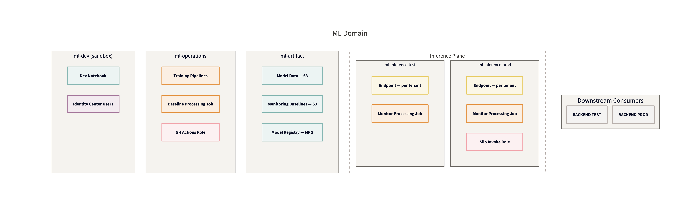
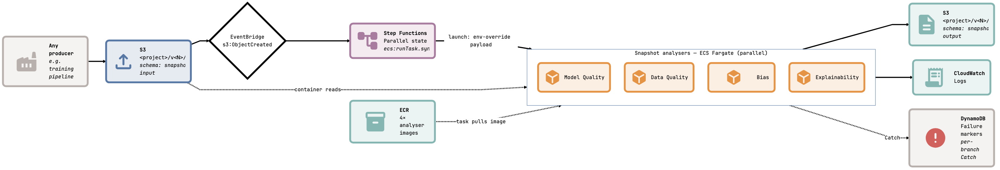
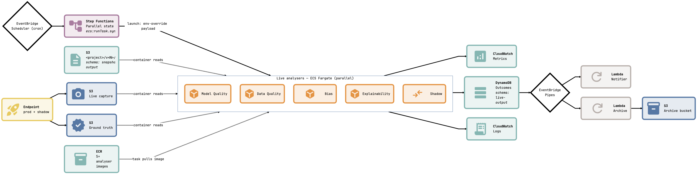

# model-monitor-custom

Modern AWS batch analysis system. First use case: replace SageMaker Model Monitor + Clarify with own-container, own-math drift + bias + explainability monitoring. Decoupled by design — anything that writes to S3 can trigger a snapshot analysis run.

## Status

**Phase 1 complete** — interfaces, schemas, protocols, fixtures, CI skeleton. All RED tests in place.
**Phase 2 next** — CDK stacks (`ArtifactStack`, `SharedIamStack`, `InferenceMonitorStack`) with busybox placeholder + first container skeleton. See [`docs/ROADMAP.md`](docs/ROADMAP.md).

## Architecture at a glance

Three subsystems coupled only by published JSON schemas.

```
[ Producer ]  →  s3://…/input/  →  [ Snapshot analysis ]  →  s3://…/output/  →  [ Live analysis ]  →  CW + DDB
```

Full mental model + I/O contract: [`docs/ARCHITECTURE.md`](docs/ARCHITECTURE.md).
Design decisions (IaC layout, container base, anti-SageMaker guardrails): [`docs/design/`](docs/design/).
Non-negotiables (TDD, ruff, ty): [`docs/STANDARDS.md`](docs/STANDARDS.md).

### Account topology



### Snapshot analysis (one-shot, per model version)



### Live analysis (recurring, per endpoint)



## Layout

```
cdk/           CDK v2 Python — constructs + stacks (Phase 2)
containers/    analyser containers (baseline, monitor)
shared/        published JSON schemas + optional Python helpers
docs/          design + architecture + standards + roadmap
  research/    grounded research backing the design decisions
  diagrams/    D2 + Mermaid sources + rendered PNGs
scripts/       local reproduce + parity helpers
tests/         unit + integration + fixtures
```

## Why this exists

SageMaker Model Monitor + Clarify have proven brittle: opaque errors, undocumented input shapes, 1/sec `CreateProcessingJob` throttle, upstream OSS repo dormant. Every production ML monitoring stack in public writing (Netflix, Uber, Airbnb, Evidently, WhyLabs, Arize, Fiddler) uses **custom containers on own compute**. This repo is that pattern, standalone.

Full evidence-backed case: [`docs/research/SM_MODEL_MONITOR_ASSESSMENT.md`](docs/research/SM_MODEL_MONITOR_ASSESSMENT.md).

## Contributing

R&D repo. Draft PRs only. TDD required — RED test before production code. Full contributor checklist in [`docs/STANDARDS.md`](docs/STANDARDS.md).
