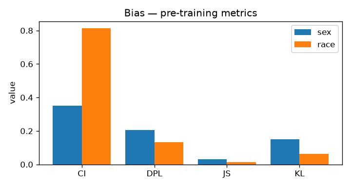
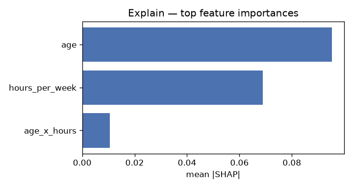
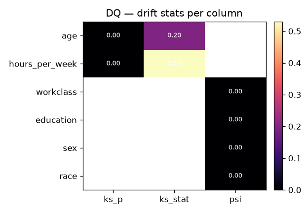
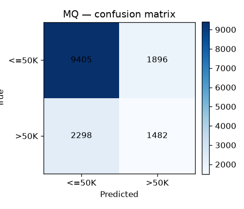
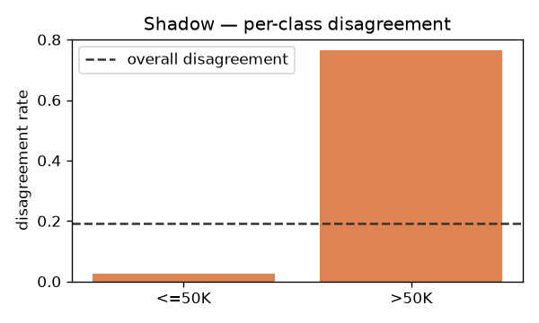

# End-to-end example — Adult classifier

_Last regenerated: 2026-08-01T17:10:34+00:00_

Auto-generated by `uv run python -m mmc_example_adult.run`. Do not hand-edit — regenerate instead.

## Setup

- Dataset: `tests/fixtures/adult.parquet` (UCI Adult snapshot, ~30k rows).
- Model: `sklearn.linear_model.LogisticRegression` on `age`, `hours_per_week`, `age * hours_per_week`.
- Splits: 50 % baseline, 50 % current-window with synthetic drift injected (older + more hours).
- Shadow variant: same features, `C=0.1` — introduces measurable disagreement.

## Rollup

| Analyser | Outcome | Severity | Violations | Plot |
| --- | --- | --- | --- | --- |
| `bias` | succeeded_with_violations | warn | 2 | `examples/adult-classifier/outputs/plots/bias_pre_training.png` |
| `explain` | succeeded | info | 0 | `examples/adult-classifier/outputs/plots/explain_shap_top_features.png` |
| `dq` | succeeded_with_violations | warn | 2 | `examples/adult-classifier/outputs/plots/dq_drift_heatmap.png` |
| `dq_control` | succeeded | info | 0 | — |
| `mq` | succeeded_with_violations | alert | 2 | `examples/adult-classifier/outputs/plots/mq_confusion_matrix.png` |
| `shadow` | succeeded_with_violations | warn | 1 | `examples/adult-classifier/outputs/plots/shadow_per_class_disagreement.png` |

## bias

- **Outcome:** `succeeded_with_violations`
- **Severity:** `warn`
- **Violations:** 2
- **Highlights:** `{"facets": ["sex", "race"], "race/pre/DPL": 0.13265564473251132, "sex/pre/DPL": 0.20476453424163865}`

## explain

- **Outcome:** `succeeded`
- **Severity:** `info`
- **Violations:** 0
- **Highlights:** `{"top_features": ["age", "hours_per_week", "age_x_hours"]}`

## dq

- **Outcome:** `succeeded_with_violations`
- **Severity:** `warn`
- **Violations:** 2
- **Highlights:** `{"drifted_window": true, "schema_diff": {"extra": [], "missing": []}, "violations": 2}`

## dq_control

- **Outcome:** `succeeded`
- **Severity:** `info`
- **Violations:** 0
- **Highlights:** `{"drifted_window": false, "schema_diff": {"extra": [], "missing": []}, "violations": 0}`

## mq

- **Outcome:** `succeeded_with_violations`
- **Severity:** `alert`
- **Violations:** 2
- **Highlights:** `{"accuracy": 0.7219017306544658, "auc": 0.7294418038577848, "f1_macro": 0.6158830134574795}`

## shadow

- **Outcome:** `succeeded_with_violations`
- **Severity:** `warn`
- **Violations:** 1
- **Highlights:** `{"agreement": 0.808699688349579, "js_divergence": 0.01482227085429646}`

## Verdict

System flags drift on the drifted window (`dq` → `succeeded_with_violations`, 2 violations) and returns `succeeded` on the clean control — so no false positives on no-drift data.
